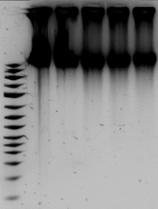

Genomic DNA extraction from _E. coli_ K-12
==========================================

Goal:
=====

Extract DNA of the strains cultivated in [Experiment 1: Bacterial Cultivation](https://elab.dataplan.top/experiments.php?mode=view&id=18) for further analysis 

Procedure:
==========

Use [Methode - NucleoSpin Microbial DNA Kit (Macherey & Nagel)](https://elab.dataplan.top/experiments.php?mode=view&id=55) for DNA extraction.

Manufacturer’s instructions, with lysozyme pre-treatment (20 mg/mL, 30 min, 37 °C)

\- MN Bead Tubes Type B 

\- Disruption time 4 min

Results:
========

**Elution volume:** 100 µL BE buffer

  
**DNA concentration (Qubit dsDNA HS Assay):**

<table style="height:291.078px;width:25.0569%;"><tbody><tr style="height:67.1719px;"><th style="width:21.5697%;height:67.1719px;">Sample ID</th><th style="width:24.0001%;height:67.1719px;">DNA conc. [ng/µL]</th><th style="width:25.2153%;height:67.1719px;">A260/280</th><th style="width:4.25319%;height:67.1719px;">A260/230</th></tr><tr style="height:22.3906px;"><td style="width:21.5697%;height:22.3906px;">EC-01</td><td style="width:24.0001%;height:22.3906px;">95.5</td><td style="width:25.2153%;height:22.3906px;">1.81</td><td style="width:4.25319%;height:22.3906px;">2.10</td></tr><tr style="height:22.3906px;"><td style="width:21.5697%;height:22.3906px;">EC-02</td><td style="width:24.0001%;height:22.3906px;">87.2</td><td style="width:25.2153%;height:22.3906px;">1.78</td><td style="width:4.25319%;height:22.3906px;">2.05</td></tr><tr style="height:22.3906px;"><td style="width:21.5697%;height:22.3906px;">EC-03</td><td style="width:24.0001%;height:22.3906px;">89.7</td><td style="width:25.2153%;height:22.3906px;">1.80</td><td style="width:4.25319%;height:22.3906px;">2.10</td></tr><tr style="height:22.3906px;"><td style="width:21.5697%;height:22.3906px;">EC-04</td><td style="width:24.0001%;height:22.3906px;">75.7</td><td style="width:25.2153%;height:22.3906px;">1.79</td><td style="width:4.25319%;height:22.3906px;">2.08</td></tr><tr style="height:22.3906px;"><td style="width:21.5697%;height:22.3906px;">EC-05</td><td style="width:24.0001%;height:22.3906px;">90.5</td><td style="width:25.2153%;height:22.3906px;">1.80</td><td style="width:4.25319%;height:22.3906px;">2.09</td></tr><tr style="height:22.3906px;"><td style="width:21.5697%;height:22.3906px;">EC-06</td><td style="width:24.0001%;height:22.3906px;">89.8</td><td style="width:25.2153%;height:22.3906px;">1.78</td><td style="width:4.25319%;height:22.3906px;">2.08</td></tr><tr style="height:22.3906px;"><td style="width:21.5697%;height:22.3906px;">EC-07</td><td style="width:24.0001%;height:22.3906px;">88.1</td><td style="width:25.2153%;height:22.3906px;">1.81</td><td style="width:4.25319%;height:22.3906px;">2.10</td></tr><tr style="height:22.3906px;"><td style="width:21.5697%;height:22.3906px;">EC-08</td><td style="width:24.0001%;height:22.3906px;">97.7</td><td style="width:25.2153%;height:22.3906px;">1.81</td><td style="width:4.25319%;height:22.3906px;">2.06</td></tr><tr style="height:22.3906px;"><td style="width:21.5697%;height:22.3906px;">EC-09</td><td style="width:24.0001%;height:22.3906px;">96.4</td><td style="width:25.2153%;height:22.3906px;">1.79</td><td style="width:4.25319%;height:22.3906px;">2.07</td></tr><tr style="height:22.3906px;"><td style="width:21.5697%;height:22.3906px;">EC-10</td><td style="width:24.0001%;height:22.3906px;">86.6</td><td style="width:25.2153%;height:22.3906px;">1.78</td><td style="width:4.25319%;height:22.3906px;">2.10</td></tr></tbody></table>

**Storage:** -20 °C until library prep  
**Notes:** DNA was of sufficient purity for downstream library preparation.

Quality check:

Gel type: 1% Agarose, TAE, Ethidium Bromide

Ladder: Generuler 1kb Plus

High molecular weight DNA observed for all samples, no signs of shearing or degradation.