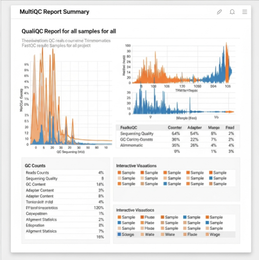

Goal:
=====

Preprocessing and assembly of _E.coli_ genomes

Used data from sequencing run [Assay - Experiment 4: Sequencing Run](https://elab.dataplan.top/experiments.php?mode=view&id=21)

Procedure:
==========

**Methods:**

*   **Software:**
    *   **Quality Control:** FastQC (v0.11.9), MultiQC (v1.9)
    *   **Trimming:** Trimmomatic (v0.39)
    *   **Assembly:** SPAdes (v3.15.3)
    *   **Annotation:** Prokka (v1.14.6), NCBI RefSeq
*   **Bioinformatics Pipeline:** Custom Snakemake workflow (Version 1.2)
*   **Reference Database:** NCBI RefSeq bacterial genomes (downloaded 2025-06-01)

**Results:**

*   **QC Reports:** All samples passed quality thresholds (high quality reads, minimal adapter contamination).
*   **Assembly Statistics:**
    *   Average Contig N50: 1.5 Mbp
    *   Total Contig Length: ~4.8-5.2 Mbp per sample (consistent with _E. coli_ genome size)
    *   Number of Contigs: 50-70 per sample
*   **Annotation:**
    *   Number of Predicted Genes: ~4500-5000 per sample
    *   Identified Species: _Escherichia coli_ K-12 confirmed for all samples.

Results:
========

**Data Access Link (External):** `smb://institutionserver/microbial_genomics_data/analysis/20250625_MGL_Analysis_Run1` (Contains assembled genomes, annotation files, QC reports) 

